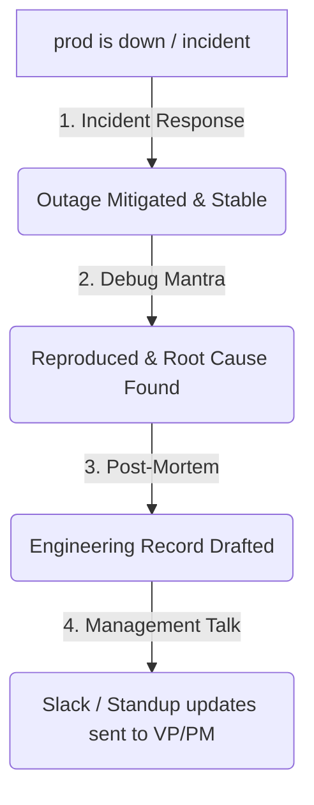
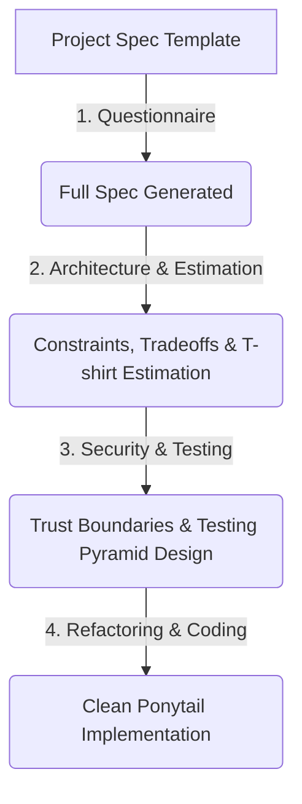

# Modular Skills & Commands Reference Guide

Welcome to the command reference and usage guide for the `tanayuts` modular skill plugin. This document outlines how to install the plugin, trigger specific skills, use intensity controls, and chain workflows.

---

## 🚀 Installation & Invocation

To install this plugin in **Claude Code**, run:
```bash
claude plugin install github:tanayuts/tanayuts
```

To invoke a specific skill, you can use the corresponding slash command in the Claude Code terminal (e.g., `/tanayuts:coding-philosophy` or `/tanayuts:incident-response`) or type the natural language **trigger phrases** listed below in your prompt.

---

## 📊 Quick Reference Table

| Skill | Trigger Keywords / Commands | Purpose | Intensity Controls / Flags |
| :--- | :--- | :--- | :--- |
| **[Coding Philosophy](#1-coding-philosophy)** | `ponytail-review`, `ponytail-audit`, `ponytail-debt`, *(always active)* | Enforces clean, lazy, minimal code. | `/ponytail lite\|full\|ultra`, `stop ponytail` |
| **[Debugging & Review](#2-debugging--review)** | `debug`, `error`, `crash`, `scrutinize`, `/post-mortem` | Debug mantra, Scrutinize PR review, Post-mortem. | `/post-mortem`, `scrutinize` |
| **[Incident Response](#3-incident-response)** | `prod is down`, `incident`, `sev 1`, `pagerduty` | Fire drill: triage, rollback, and mitigate outages. | `sev 1`, `sev 2`, `sev 3` |
| **[Architecture & Estimation](#4-architecture--estimation)** | `design`, `architect`, `estimate`, `t-shirt size` | Boring-tech system design & T-shirt estimation. | XS, S, M, L, XL sizing |
| **[Refactoring & Performance](#5-refactoring--performance)** | `refactor`, `optimize`, `profile`, `it's slow` | Safe step-by-step refactoring & bottleneck profiling. | Target metric (e.g. p95 < 200ms) |
| **[Security & Testing](#6-security--testing)** | `security review`, `security audit`, `test plan` | OWASP threat boundaries review & testing strategy. | Testing pyramid assignments |
| **[Teaching & Writing](#7-teaching--writing)** | `teach me`, `socratic`, `ADR`, `runbook`, `README` | Socratic teaching & technical doc templates. | `semi-socratic`, `explain but quiz me` |
| **[Template Spec](#8-template-spec)** | `create a project spec`, `system directive` | Ask 7 questions & generate detailed agent spec. | Conditionally structured by complexity |
| **[Communication](#9-communication--self-regulation)** | `write for management`, `slack update`, `standup` | Reframe tech issues for Slack, JIRA, Standups, Email. | JIRA, Slack, Email, Standup, Meeting |

---

## 🛠️ Detailed Skill Manual

### 1. Coding Philosophy
Enforces DietrichGebert's **Ponytail philosophy** (YAGNI, standard library first, minimum code, explicit `ponytail:` comments to name limits and upgrade paths).

* **Trigger Words:** Auto-activated on all coding tasks.
* **Modes & Intensity Switches:**
  * `/ponytail lite` — Suggests lazy alternatives, lets the user choose.
  * `/ponytail full` — *(Default)* Enforces the YAGNI ladder, stdlib first, shortest diffs.
  * `/ponytail ultra` — Extremist mode: deletes code first, challenges every requirement.
  * `stop ponytail` / `normal mode` — Disable the philosophy.
* **Sub-Commands:**
  * `ponytail-review` — Review diffs for bloat/over-engineering. Score with: `net: -N lines possible.`
  * `ponytail-audit` — Scan the entire repository for dead code, abstractions, and boilerplate.
  * `ponytail-debt` — Grep and list all `// ponytail:` comment shortcuts, their ceilings, and upgrade paths.
* **Example Prompts:**
  * `ponytail ultra`
  * `ponytail-review this PR diff`
  * `show me the ponytail-debt ledger`

---

### 2. Debugging & Review
Combines 9arm's debugging principles, PR scrutiny, and engineering post-mortems (RCAs).

* **Trigger Words:** `debug`, `error`, `crash`, `PR review`, `scrutinize`, `post-mortem`.
* **Modes & Workflows:**
  * **Debug Mantra** — Verbatim recital of 4 steps (Reproduce -> Fail path -> Falsify hypothesis -> Breadcrumb ledger). Requires a deterministic repro before proposing any fix.
  * **Scrutinize** — End-to-end trace of a change. Challenges the intent, finds edge cases, and checks tests. Output severity: `Blocker` -> `Major` -> `Nit`.
  * **Post-mortem (`/post-mortem`)** — Technical write-up for engineers. Requires **4 verified inputs** (repro, root cause, fix, validation).
* **Example Prompts:**
  * `debug why the user registration is failing`
  * `scrutinize this auth helper file`
  * `write a post-mortem for JIRA-4202`

---

### 3. Incident Response
Real-time fire drill protocol for production outages. **Mitigate first, debug second.**

* **Trigger Words:** `prod is down`, `incident`, `sev 1`, `outage`, `rollback`.
* **The 5-Step Protocol:**
  1. **Triage:** Define what's broken, who's affected, since when, and severity (SEV-1/2/3).
  2. **Mitigate:** Rollback, feature flag off, failover, or restart. Fix the outage, not the root cause.
  3. **Communicate:** Draft updates for Slack, Stakeholders, or External Status Page.
  4. **Timeline:** Maintain a UTC log of events and actions.
  5. **Resolve & Hand off:** Declare resolved, describe the mitigation, and pass the timeline to the post-mortem pipeline.
* **Example Prompts:**
  * `prod is down! Payment gateway is throwing timeouts since 10 mins ago`
  * `we need to roll back the release due to CPU spikes`

---

### 4. Architecture & Estimation
System design tradeoffs and T-shirt size estimation. Enforces boring, reversible, and scalable systems.

* **Trigger Words:** `design system`, `architect this`, `estimate this`, `T-shirt size`.
* **System Design Workflow:** Clarify scaling/timeline constraints (max 3 questions) -> Propose simplest architecture -> Present tradeoff tables (max 3 options) -> Call out ceilings.
* **Estimation Sizing:**
  * **XS** (< 2 hrs), **S** (2-8 hrs), **M** (1-3 days), **L** (1-2 weeks), **XL** (> 2 weeks).
  * State assumptions clearly. Never provide hour estimates unless explicitly asked.
* **Example Prompts:**
  * `design a highly concurrent notification worker service`
  * `estimate the task: Migrate database to support multiple user profiles`

---

### 5. Refactoring & Performance
Safe structure transformations and bottleneck profiling.

* **Trigger Words:** `refactor`, `restructure`, `optimize`, `profile`, `it's slow`, `latency`.
* **Refactoring:** Establish a safety net (run/write tests first) -> Plan steps -> Execute & commit one transformation at a time.
* **Performance:** Define target metrics (e.g. latency, throughput) -> Profile (do not guess) -> Optimize bottleneck -> Stop when target is met.
* **Example Prompts:**
  * `refactor the nested loops in payment_utils.py`
  * `profile this endpoint, it takes over 5 seconds to respond`

---

### 6. Security & Testing
Threat modeling, OWASP vulnerability checklist, and testing pyramid strategy.

* **Trigger Words:** `security review`, `security audit`, `test plan`, `vulnerability check`.
* **Security Review:** Maps trust boundaries (input files, forms, API keys) -> Runs checklist (Injection, Auth, Access control, Data encryption, Logic rate-limiting) -> Reports severity and fixes.
* **Testing Strategy:** Maps critical paths -> Assigns levels (Unit -> Integration -> E2E) using the testing pyramid -> Details what to test and what to intentionally skip.
* **Example Prompts:**
  * `do a security review of our file upload flow`
  * `create a test plan for the shopping cart checkout logic`

---

### 7. Teaching & Writing
Guided learning (Socratic mode) and technical document formatting.

* **Trigger Words:** `teach me`, `socratic`, `ADR`, `runbook`, `README`.
* **Socratic Mode:** Guides you via diagnostic, narrowing, or connecting questions. One question at a time.
  * Trigger `semi-socratic` or `explain but quiz me` for brief lectures with quick check-up questions.
* **Technical Writing:** Creates templates for:
  * **README** (Prerequisites, quick start, architecture, testing).
  * **ADR** (Context, decision, alternatives, consequences).
  * **Runbook** (Diagnosis step-by-step commands, copy-pasteable resolution, rollback, escalation).
  * **Changelog** (Added, Changed, Fixed, Removed, Breaking with migration instructions).
* **Example Prompts:**
  * `teach me the difference between concurrency and parallelism`
  * `write an ADR for adopting PostgreSQL instead of MongoDB`
  * `create a runbook for high disk usage alerts on the worker nodes`

---

### 8. Template Spec
Creates project specifications for other AI agents to build from scratch.

* **Trigger Words:** `create a project spec`, `system directive`, `implementation guide`.
* **Workflow:**
  1. Claude asks you **7 questions** (Name, tagline, tagline purpose, complexity, scale, user count, coding level, language).
  2. Generates a comprehensive spec file referencing [`docs/project-spec-template.md`](file:///d:/tanayuts/docs/project-spec-template.md).
* **Example Prompts:**
  * `create a project spec for a personal budgeting application`

---

### 9. Communication & Self-Regulation
Translates technical status reports and incident updates for leadership and team channels.

* **Trigger Words:** `write for management`, `slack update`, `standup note`, `status update`.
* **Channel Formats:**
  * **JIRA:** Full details (Impact, what broke, owner, next steps, workaround).
  * **Slack Channel Post:** Under 80 words, bold TL;DR, 2-4 bullets.
  * **Slack Thread Reply:** Under 40 words, direct answer, no TL;DR.
  * **Async Standup Note:** 1-3 lines. Pattern: `[State] [thing]. [Owner]. [Next].`
  * **Email:** Subject, greeting, short paragraphs, next decision point.
  * **Meeting Talking-Points:** Bullet list, one short spoken clause per bullet.
* **Example Prompts:**
  * `write a slack update for the team channel on the cache performance issue`
  * `draft talking points for the PM meeting about why we rolled back release 2.1`

---

## 🔄 Workflow Pipelines (Chaining Skills)

Modular skills are designed to connect dynamically as an engineering task progresses. Here are the primary workflows:

### Outage Recovery Pipeline


### New Project Pipeline

